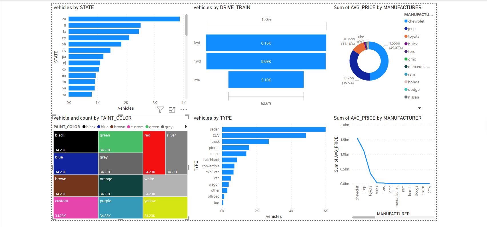

### Craigslist Vehicles Data Transformation & Visualization

**Inventory Levels:** Fact tables to display inventory levels over time, helping the company manage their stock and make informed decisions about inventory management

**Price Distribution:** Fact tables to display price distribution across manufacturers and models, helping the company understand the price range of vehicles in the market and set competitive pricing strategies

**Vehicle Attributes:** By analyzing the attributes of vehicles sold, such as make, model, and fuel type, the company can create bar charts or other visualizations to understand customer preferences and guide their inventory decisions

### Implementation

- [x] Clean data (for proper formatting)   
- [x] Load CSV data into Postgresql with SQL `copy` command
- [x] Export CSV data with `copy` command
- [x] Send CSV file to Amazon S3
- [x] Setup Snowflake to respond to new S3 upload events with Amazon SQS
- [x] On AWS insert event, refresh data in Snowflake
- [x] Load data from Snowflake on PowerBI
- [x] Use data to create visuals

### Tools

- postgresql
- snowflake
- dbt
- powerBI
- AWS (S3 & SQS)
